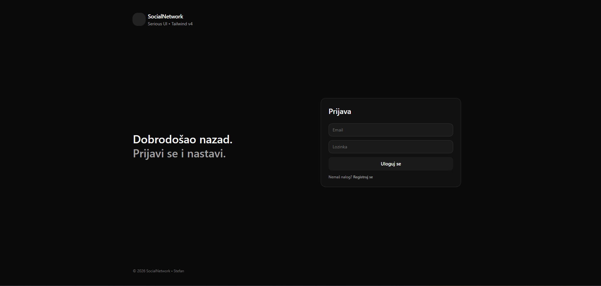
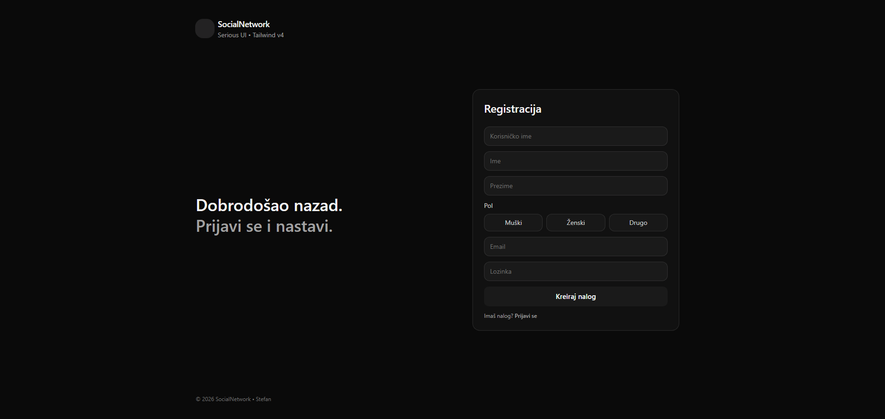
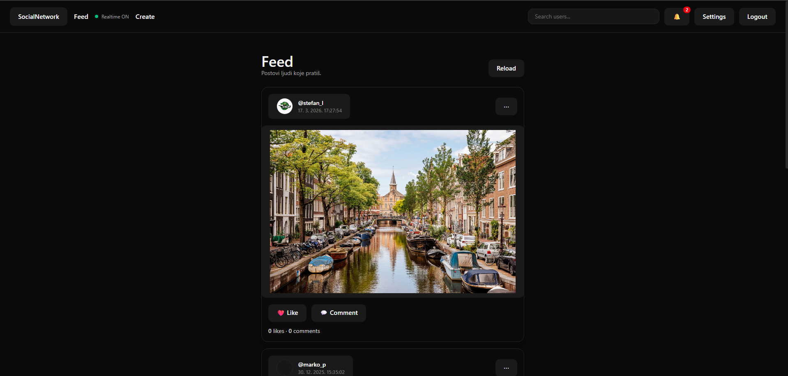
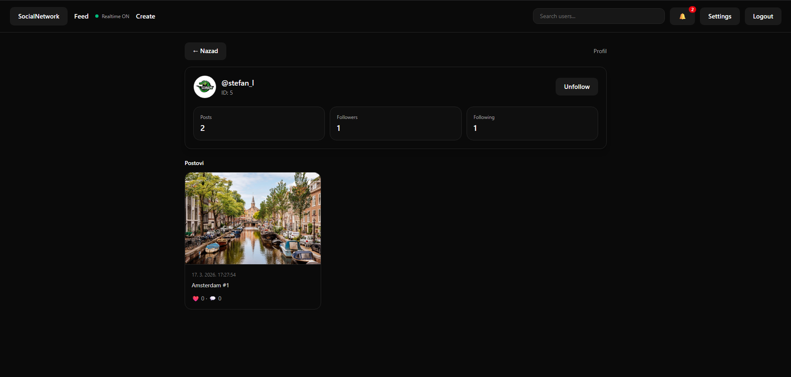
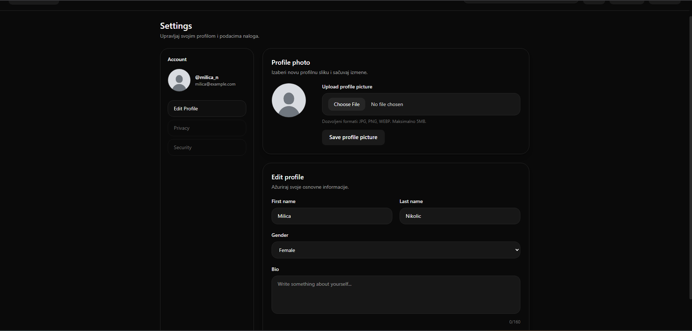

# 🚀 Social Network Platform

Full-stack social network application built with **ASP.NET Core Web API**, **SQL Server**, **React**, and **SignalR** for real-time communication.

---

## ✨ Features

### ✅ Completed

* User registration & login (JWT authentication)
* Profile management
* Create & delete posts
* Like & unlike posts
* Comments system
* Follow / unfollow users
* Real-time notifications (SignalR)
* Real-time chat
* File/image upload
* Swagger API documentation

### 🚧 In Progress

* Admin panel
* Advanced moderation system

---

## 🛠 Tech Stack

### Backend

* ASP.NET Core Web API (.NET)
* SQL Server
* JWT Authentication
* SignalR
* Layered Architecture (API / Application / Domain / Infrastructure)

### Frontend

* React
* TypeScript
* Vite
* React Router
* React Hook Form
* Zod
* Axios
* Tailwind CSS

---

## 📁 Project Structure

```
social-network-app/
  backend/
    SocialNetwork.API/
    SocialNetwork.Application/
    SocialNetwork.Domain/
    SocialNetwork.Infrastructure/
  frontend/
  database/
  screenshots/
```

---

## ⚙️ Getting Started

### Backend

1. Open solution in Visual Studio
2. Update `appsettings.json`:

```json
{
  "ConnectionStrings": {
    "Default": "Server=YOUR_SERVER;Database=DB_SocialNetwork"
  }
}
```

3. Run the API

---

### Frontend

```bash
cd frontend
npm install
npm run dev
```

---

## 🗄 Database

Database scripts are located in:

```
/database/schema.sql
```

Contains:

* Tables
* Relationships
* Seed data

---

## 📡 API Documentation

Swagger is available in development mode after running the backend.

---

## 📸 Screenshots







```

---

## 💡 About Project

This project was developed as a full-stack portfolio and academic project, focusing on:

* Scalable architecture
* Real-time communication
* Authentication & authorization
* Relational database design

---

## 👨‍💻 Author

Stefan Petrovic
